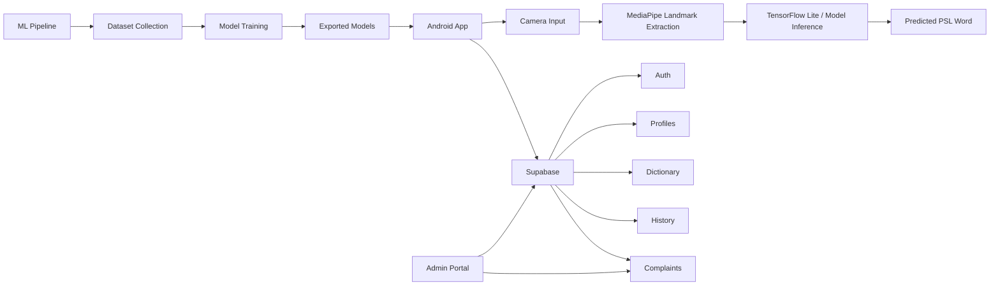

# SignSpeak

SignSpeak is a Final Year Project focused on Pakistan Sign Language (PSL) recognition, learning, and moderation workflows.

This repository is a multi-module workspace that contains:

- an Android mobile app built with Kotlin and Jetpack Compose
- a React + Vite admin portal for complaint review
- a Python ML pipeline for data collection, training, and inference
- Supabase schema, seed data, and complaint portal SQL helpers

## At a Glance


## Problem Statement

SignSpeak aims to reduce communication barriers between Deaf/Hard-of-Hearing users and hearing individuals by making PSL translation and learning more accessible on mobile devices.

The project is not just a recognition model. It combines:

- live sign recognition on Android
- dictionary and learning support for PSL vocabulary
- complaint capture and moderation workflows
- a training pipeline for iterating on sign models

## Repository Modules

| Module | Purpose | Stack |
| --- | --- | --- |
| [`kotlin app/`](./kotlin%20app/) | Android app for translation, dictionary, history, profile, and reporting | Kotlin, Jetpack Compose, CameraX, TensorFlow Lite, MediaPipe, Supabase |
| [`front-end-web/`](./front-end-web/) | Admin portal for reviewing and resolving complaints | React 19, Vite, TypeScript, Supabase |
| [`ml-pipeline/`](./ml-pipeline/) | Data collection, model training, export, and inference utilities | Python, TensorFlow, Keras, MediaPipe |
| [`supabase/`](./supabase/) | SQL migrations, seed data, and setup notes | Supabase SQL |

## Core Features

### Mobile App

- Real-time PSL translation using the camera
- Translation history with saved predictions
- Searchable PSL dictionary with categories and bookmarks
- User authentication via Supabase
- Complaint submission for wrong predictions or dictionary issues
- Profile and account management

### Admin Portal

- Secure admin login with role-based access
- Complaint queue with filtering and search
- Complaint detail workspace with prediction and reporter context
- Status management for `open`, `reviewing`, `resolved`, and `rejected`
- Admin notes for moderation decisions

### ML Pipeline

- Landmark-based data collection
- LSTM training scripts
- Data augmentation workflow
- Real-time inference utilities
- Model export utilities for mobile integration

## Architecture



## Technology Stack

| Layer | Technology |
| --- | --- |
| Mobile | Kotlin, Jetpack Compose, CameraX |
| ML on Device | TensorFlow Lite, MediaPipe Tasks |
| Admin Web | React, Vite, TypeScript |
| Backend/Data | Supabase Auth, Postgres, SQL migrations |
| Training Pipeline | Python, TensorFlow, Keras, OpenCV, MediaPipe |

## Project Structure

```text
SignSpeak/
|-- front-end-web/          # React admin portal
|-- kotlin app/             # Android application
|   |-- app/
|   `-- gradle/
|-- ml-pipeline/            # Data collection and model training pipeline
|-- supabase/               # SQL migrations and seed data
|-- .gitignore
`-- README.md
```

## Prerequisites

Use the prerequisites that match the module you want to run.

### General

- Git
- A Supabase project

### Android App

- Android Studio with Android SDK installed
- A working JDK available through Android Studio or system setup
- Android device or emulator

### Admin Portal

- Node.js 20+ recommended
- npm

### ML Pipeline

- Python 3.9, 3.10, or 3.11
- Webcam for data collection / inference

## Quick Start

### 1. Clone the Repository

```bash
git clone <your-repository-url>
cd SignSpeak
```

### 2. Configure Supabase

Run the SQL files in this order:

1. [`supabase/migrations/20260327_signspeak_v1.sql`](./supabase/migrations/20260327_signspeak_v1.sql)
2. [`supabase/migrations/20260327_admin_complaints_portal.sql`](./supabase/migrations/20260327_admin_complaints_portal.sql)
3. [`supabase/seed.sql`](./supabase/seed.sql)

Then:

- create at least one user in Supabase Auth
- promote the admin user by setting `public.profiles.role = 'admin'`

More detail is available in [`supabase/README.md`](./supabase/README.md).

## Run the Admin Portal

```bash
cd front-end-web
npm install
```

Create a `.env` file from `.env.example` and set:

```env
VITE_SUPABASE_URL=your_supabase_url
VITE_SUPABASE_PUBLISHABLE_KEY=your_publishable_key
```

Start the dev server:

```bash
npm run dev
```

Build for production:

```bash
npm run build
```

## Run the Android App

The Android app lives in [`kotlin app/`](./kotlin%20app/).

You must provide:

- `SUPABASE_URL`
- `SUPABASE_PUBLISHABLE_KEY`

You can set them in:

- Gradle properties
- system environment variables

From the repository root on Windows:

```powershell
cd "kotlin app"
.\gradlew.bat app:installDebug
```

Generic Gradle commands:

```bash
cd "kotlin app"
./gradlew app:assembleDebug
./gradlew app:installDebug
```

Current Android app configuration:

- application ID: `com.example.kotlinfrontend`
- minimum SDK: 26
- target SDK: 36
- app name: `SignSpeak`

## Run the ML Pipeline

```bash
cd ml-pipeline
python -m venv venv
```

Activate the virtual environment and install dependencies:

### Windows PowerShell

```powershell
.\venv\Scripts\Activate.ps1
pip install -r requirements.txt
```

### Linux / macOS

```bash
source venv/bin/activate
pip install -r requirements.txt
```

Typical workflows:

```bash
# Data collection
python src/data_collection/collect_data_gui.py

# Model training
python src/training/train_model.py
python src/training/train_model_with_augmentation.py

# Real-time inference
python src/inference/realtime_inference_minimal.py
```

See [`ml-pipeline/README.md`](./ml-pipeline/README.md) for the detailed ML workflow.

## Deployment Notes

### Admin Portal on Render

The admin portal is a static Vite app. A typical Render static-site setup uses:

- build command: `cd front-end-web && npm ci && npm run build`
- publish directory: `front-end-web/dist`

Required environment variables:

- `VITE_SUPABASE_URL`
- `VITE_SUPABASE_PUBLISHABLE_KEY`

## Supabase Data Model Usage

The current app and admin portal depend on shared Supabase resources such as:

- `profiles`
- `dictionary_entries`
- `translation_history`
- `complaints`

This means:

- the Android app and admin portal must point to the same Supabase project
- complaint moderation in the admin portal works on data submitted from the mobile app

## Recommended Setup Order

If you are onboarding the project from scratch, use this order:

1. Set up Supabase migrations and seed data
2. Verify the admin user role in `profiles`
3. Run the admin portal locally
4. Build and run the Android app
5. Use the ML pipeline only when you need to retrain or validate models

## Current Status

This repository has moved beyond the original placeholder documentation. The current codebase includes:

- a Kotlin Android app, not a Flutter app
- a working React admin portal, not a planned web panel
- Supabase-based authentication and data storage
- ML tooling for model iteration and export

## Troubleshooting

### Admin portal loads but login fails

Check:

- `VITE_SUPABASE_URL`
- `VITE_SUPABASE_PUBLISHABLE_KEY`
- the user exists in Supabase Auth
- `public.profiles.role = 'admin'` for admin access

### Android build succeeds but app data features do not work

Check:

- `SUPABASE_URL`
- `SUPABASE_PUBLISHABLE_KEY`
- the Supabase migrations were applied

### Complaints do not appear in the admin portal

Check:

- both apps point to the same Supabase project
- the complaint portal migration was applied
- the complaint records actually exist in `complaints`

## Academic Context

SignSpeak was developed as a Final Year Project at COMSATS University Islamabad, Abbottabad Campus.

### Team

- AbuZar Babar
- Mohib Ullah Khan Sherwani
- M. Abdullah Umar

### Supervisor

- Dr. Rab Nawaz Jadoon

## Contributing

This is an academic project repository. If you extend it:

- keep module-specific setup notes in each module README
- keep the root README focused on architecture and onboarding
- update Supabase setup instructions when schema changes
- document any new deployment or model export steps

## Related Documentation

- [`front-end-web/README.md`](./front-end-web/README.md)
- [`supabase/README.md`](./supabase/README.md)
- [`ml-pipeline/README.md`](./ml-pipeline/README.md)
